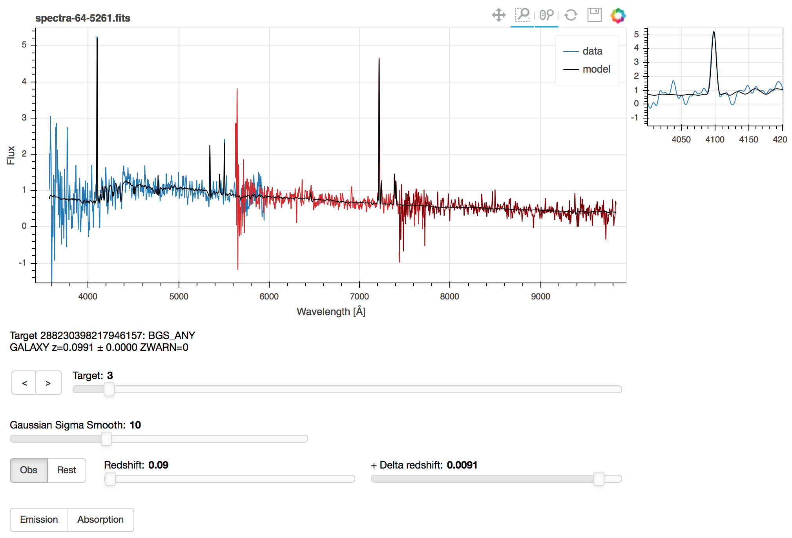

# prospect

Digging into DESI spectra, looking for stuff

This repo is a rewrite of https://github.com/desihub/inspector, which itself is very much a work in progress.  This repo is intended to provide similar functionality as inspector, but do so without using ipywidgets so that it can be used as standalone code outside of jupyter notebooks (while still also working within Jupyter notebooks).

## What it does

* Provides an interactive spectral viewer for DESI data at NERSC without
  needing to download or install anything locally.
* Interative zoom and pan
* Shows redrock results including the redshift, ZWARN flags, and the
  best fit model.
* Mouse over a region of the spectrum to get a real-time zoom in a sub-window;
  this is handy for inspecting narrow emission lines without zooming in and out
  on each one.
* Shows TARGETID and targeting bits from DESI_TARGET, MWS_TARGET,
  and BGS_TARGET.
* Highlight common emission / absorption lines.

## Added here but not in the original inspector

* Restframe wavelengths
* User-defined smoothing
* User-defined redshift
* Viewing spectra that don't yet have redshift fits

## Currently missing (but present in the original inspector)

* Imaging survey thumbnails and links.
* Buttons for saving visual inspection results before moving to next target.

## What it doesn't do (yet)

Any of these could be added later but don't yet exist.
If you really want a feature, please consider contributing it.

* Show individual exposures (multiple exposures are coadded prior to display)
* Show errors and masks
* Show the Nth best fit instead of just the best fit
* More target info like mags and shapes
* Displaying model of 2D sky-subtracted raw data
* Filtering to individual exposures or tiles

**Stephen Bailey** Lawrence Berkeley National Lab 
**Benjamin Weaver** National Optical Astronomy Observatory 
Summer 2018
